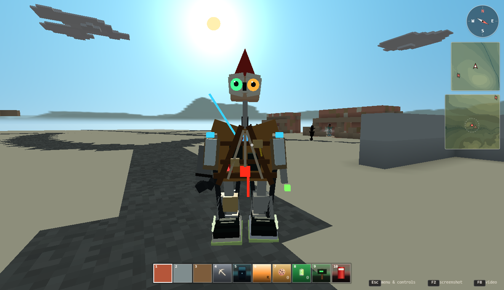
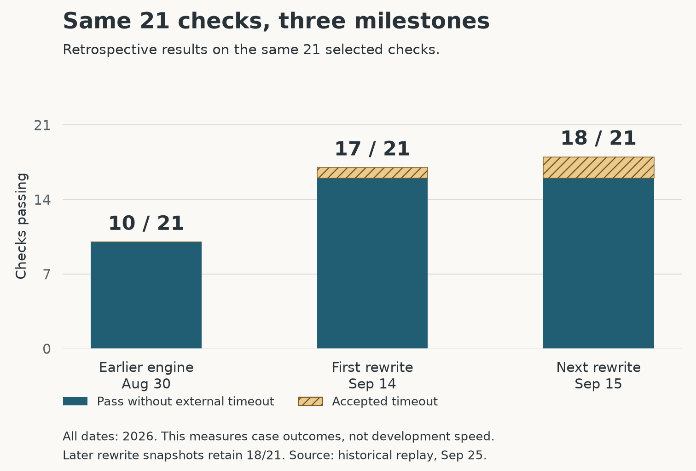

# "Cyclops Storm" Prolog

*[AkiyaBlocks](https://github.com/Nate-BadScienceFiction/AkiyaBlocks), an opinionated game engine I'm developing with AI assistance. Screenshot from the prototype.*

Open lab notes on using AI to help build a logic engine for science-fiction worlds. [My Substack](https://natecombs.substack.com/).

The earlier work in [BadScienceFiction-CyclopsStorm](https://github.com/Nate-BadScienceFiction/BadScienceFiction-CyclopsStorm) grew through continual refactoring. I'm now investigating a fresh Python implementation in [AkiyaBlocks-CyclopsStorm](https://github.com/Nate-BadScienceFiction/AkiyaBlocks-CyclopsStorm). I want to see which behaviors improve, which carry over, and what gets lost in the rewrite.

Both engine repositories are currently private. I'll make them public in the future; their GitHub links require access until then.

## Are we doing good?

I think so. In the [shared checks](https://nate-badsciencefiction.github.io/logic-engine-experiment/evidence/#reading-results), the rewrite keeps the basic reasoning working and improves how it handles calculations and information. That gives me more confidence in building the game on top of it.

- **18 vs. 10** checks pass, out of 21.
- **16 vs. 10** pass when the two cases that allow a timeout are left out.
- **17 of 21** already pass in the first saved rewrite.

Explanation support still needs work, including [a check the earlier engine passes](https://nate-badsciencefiction.github.io/logic-engine-experiment/evidence/#case-capability.rule-level-explanation-of-a-derived-fact). I want to be able to inspect why the engine reached an answer, too. I can't put a reliable “times faster” number on the rewrite: we haven't recorded comparable working hours or costs. The [progress overview](https://nate-badsciencefiction.github.io/logic-engine-experiment/evidence/development-progress.html) summarizes the changes and links to the detailed measurements.

## Comparison results — 09/24/2026

I gave both versions the same [21 small tasks](https://nate-badsciencefiction.github.io/logic-engine-experiment/evidence/#reading-results) and checked whether they produced the expected results. The tasks cover following rules, working with numbers and information, handling problems, and responding to requests for explanations.

**Pass** means the result met the rule for that task. Some tasks expect an answer, some expect an error, and two allow the test runner to stop a search that has no end. [How the results are counted](https://nate-badsciencefiction.github.io/logic-engine-experiment/evidence/#outcome-definitions).

### What the results mean

The script's results show what carried over, what improved, and what still needs work. Each number below is the count of passing checks in that area.

| What the checks cover | Earlier version | Rewrite |
| --- | ---: | ---: |
| Following rules to find answers | 6 of 6 | 6 of 6 |
| Working with numbers and information | 3 of 9 | 9 of 9 |
| Errors and searches that do not finish | 0 of 3 | 3 of 3* |
| Responding to requests for explanations | 1 of 3 | 0 of 3 |

The rewrite keeps the basic reasoning covered by these checks and does better at handling information without losing or changing it. That matters for a game built around characters making decisions from rules. Explanation support remains a gap: one check that passes in the earlier version does not yet pass in the rewrite.

\* Two rewrite passes mean the test runner stopped waiting on searches with no end. They do not show the engine recognizing that its search was unfinished. Without these two tasks, the rewrite passes **16 of 19 checks**, compared with **10 of 19** for the earlier version.

Full counts and saved versions

Using the [recorded versions of the code](https://nate-badsciencefiction.github.io/logic-engine-experiment/evidence/development-progress-notes.html#timeline), the reimplementation passed 18 cases and the earlier implementation passed 10. Both were given the same cases and judged by the same rules. A [worked example](https://nate-badsciencefiction.github.io/logic-engine-experiment/evidence/#worked-example) shows the inputs, expected answers, and what each engine returned; the [full results](https://nate-badsciencefiction.github.io/logic-engine-experiment/evidence/#case-results) list all 21 outcomes.

| Result | Earlier implementation | Reimplementation |
| --- | ---: | ---: |
| Pass | 10 | 18 |
| Fail | 11 | 3 |
| Unassessable | 0 | 0 |
| Pass rate for these cases | 47.6% | 85.7% |

Nine cases pass only in the reimplementation; one passes only in the earlier implementation. Nine pass in both, and two fail in both. That leaves the reimplementation with eight more passing cases, a difference of 38.1 percentage points in this set.

The [case results](https://nate-badsciencefiction.github.io/logic-engine-experiment/evidence/) explain each outcome. The comparison script's [saved report](evidence/comparison-2026-09-24.md), [raw results](evidence/comparison-2026-09-24.json), and [task definitions](evidence/cases-2026-09-24.json) are included here as well.

## What this run tells us

The reimplementation does better on this set of cases. The cases were written with knowledge of both engines, however, and are not a random sample of Prolog programs. This comparison alone cannot tell us whether starting over is generally more effective than continual refactoring.

Twelve cases use SWI-Prolog as the full source of expected results. One combines a SWI answer expectation with a judgment about the Python API, and eight use recorded human adjudications. Some cases also cite ISO clauses. The explanation probes check whether a predicate answers a valid case and rejects a negative control; they do not check the contents of an explanation.

This run does not measure speed, memory use, or development effort. Explanation support and behavior on a broader set of programs remain open questions.

## Implementation notes

The new kernel is written in Python. It supports Horn clauses, unification, backtracking, cut, negation as failure, stratified tabling, and an Event Calculus over authored story time. It runs without importing the earlier implementation. Its [README](https://github.com/Nate-BadScienceFiction/AkiyaBlocks-CyclopsStorm/blob/9be7804c933cc8a3c51af3d8a5e4f54b012c8be6/README.md) has examples; the [behavior document](https://github.com/Nate-BadScienceFiction/AkiyaBlocks-CyclopsStorm/blob/9be7804c933cc8a3c51af3d8a5e4f54b012c8be6/docs/BEHAVIOUR.md) describes the intended semantics.

## Reference: the impact of agentic AI coding

[DHH on programming and AI — Lex Fridman Podcast #501](https://www.youtube.com/watch?v=NYFGCESmikA).

DHH describes how agentic AI changed his programming work: agents implement, test, and review code while he directs the work and decides what to accept. [Read the transcript](https://lexfridman.com/dhh-2-transcript/).

## Earlier notes

The [previous README](README-history-2026-05-28.md) preserves the refactoring history, articles, Harriet AI notes, the Spider narrative tool, and the test and code-change charts. Those charts track the earlier development process.

- [Interactive quad chart](viz/quadchart.html) and [codepack](data/kb-codepack.json)
- [Earlier architecture comparison with SWI-Prolog](docs/KB_ARCHITECTURE_VS_SWI_PROLOG.md)
- [Earlier API and design document](docs/KB_API_AND_DESIGN.md)
- [Codepack algorithm and schema](docs/ANALYZE_CODE_ALGORITHM_DESCRIPTION.md)

[Website](https://nate-badsciencefiction.github.io/logic-engine-experiment/). Comparison saved 09/24/2026; historical replay measured 09/25/2026.
