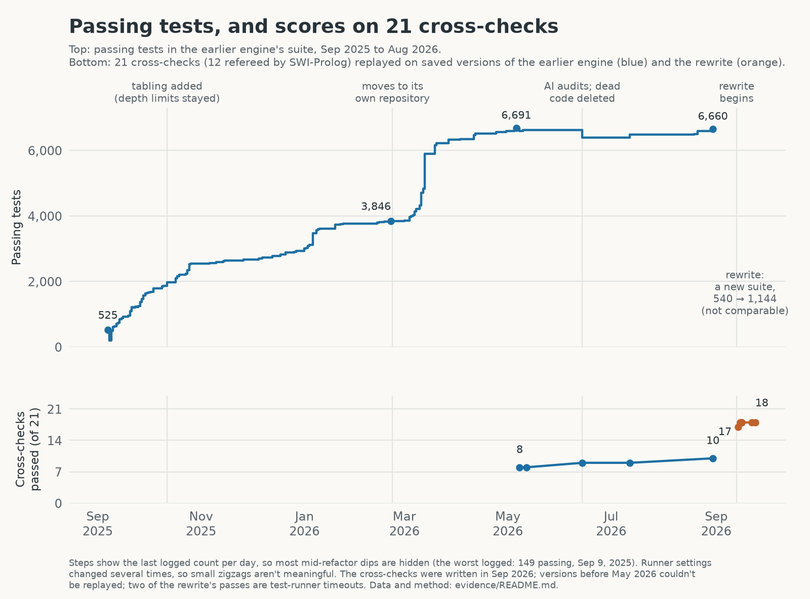

# Cyclops Storm

**A logic engine for story worlds, built by directing AI coding agents, and my lab notes on what it took to check their work.**

<figure class="masthead-image" style="margin: 0 0 1.5rem;">
  
  <figcaption>AkiyaBlocks, the game I hope to connect to Cyclops Storm. Integration is still planned.</figcaption>
</figure>

Cyclops Storm is a Prolog-style engine that keeps track of what's true in a story, when it became true, and, for things that change over time, why. AI agents (mostly Claude, via Claude Code) wrote all of it while I directed.

After a year, the engine passed 6,660 tests, but its architecture was more complex than I wanted. Much of that technical debt traced back to its beginnings in August 2025 when the engine was a playful toy and well before Opus 4.5 (arguably the agentic AI watershed moment, November 2025) marked a turning point with Claude Code's abilities to reason over large codebases. Retroactive refactoring of this product became expensive -- in tokens and time.

So in September 2026 I had them rebuild it from scratch in a new repository, from [three prompts I wrote with GPT Pro's help](docs/prompts/README.md) ([design brief](docs/prompts/1-design-brief-2026-09-13.md), [test-migration audit](docs/prompts/2-test-migration-audit-2026-09-14.md), [two-way audit](docs/prompts/3-two-way-audit-2026-09-15.md)): goals, non-goals, and a verification regime of adversarial reviews, mutation testing and checks against deliberately broken engines. The old engine stayed available as a read-only reference. This repo is the record of both versions.

This is a public record of the experiment. The engine code is still private; running it or reproducing the measurements requires access to those repositories ([status](#status)). The Prolog engine is being applied to the AkiyaBlocks game world I'm also developing with AIs, and that is still very much in flux.

## What it does

My mini story ["Firewalls and Kerosene"](https://natecombs.substack.com/p/firewalls-and-kerosene) has a scene where Harriet hacks a carnival vending machine. The engine holds that story and two others as a small timeline (17 events across 18 moments), plus about 500 facts that store the stories' sentences and link the events to them. The timeline and its effects come from a separate world file; the links to the text were generated from annotated copies of the stories. You can question it. The questions below are paraphrased; the real calls are underneath.

| Question | The engine's answer |
|---|---|
| Is the vending machine offline when Harriet's EMP goes off? | Yes. |
| Why? | Harriet's overflow hack switched it offline, and nothing has switched it back since. |
| Where does the story say the hack happened? | Here: *"…she triggered a cascade overflow that made the vending machine believe it had already been paid, disgorging every plush toy prize into her arms."* (That the hack takes the machine *offline* is the world file's reading; the sentence doesn't say so.) |
| Was it offline when it first called her name? | No. Nothing had switched it off yet. |

<details>
<summary>The actual calls and outputs</summary>

```python
kb = KnowledgeBase()
kb.consult("models/cyclops_storm/cyclops_storm_enhanced.pl")   # the three stories, as 748 facts

kb.query("holds_at(device_mode(vend_01, offline), t_emp_pulse)")   # -> [{}]   i.e. true

kb.explain("device_mode(vend_01, offline)", "t_emp_pulse").as_dict()
# {'holds': True, 'reason': 'initiated',
#  'start': {'event': 'harriet_overflow_hack', 'time': 't_hack_overflow'},
#  'clipped_by': None, ...}

kb.spans_for("happens(harriet_overflow_hack, t_hack_overflow)")    # -> ['s_1c81885e'], the sentence above

kb.explain("device_mode(vend_01, offline)", "t_vend_entices").as_dict()
# {'holds': False, 'reason': 'never_initiated', ...}
```

Run against the current engine (September 24, 2026); output trimmed.
</details>

The engine combines facts and rules with events that switch facts on and off. Rules infer relationships; events let it track what changes and point back to the event that caused a change. [How it works](docs/ENGINE.md) explains both mechanisms.

## Why build one?

**For the game.** I want characters whose behavior comes from rules I can read and audit. When a character does something odd, I want to ask why and get an answer that points to something that happened. I'd like this engine to drive characters in AkiyaBlocks, a game I'm also building with AI help. It isn't wired in, and how it would be is still open.

**For the experiment.** A logic engine is a demanding test for coding agents, because "mostly works" isn't good enough and there's a mature reference, [SWI-Prolog](https://www.swi-prolog.org/), to check answers against. I wanted to see how far agents could get under direction, and what it takes to know whether they got there. I read far less of the code than I directed, and there's no record of a human code review of the rewrite. Checking had to come from somewhere else.

## What it can do today

The current engine is the September 2026 rewrite, about 7,400 lines of Python with no dependencies.

| It can | In plain terms |
|---|---|
| Answer questions from facts and rules | Find every answer by searching and backtracking |
| Do arithmetic and comparisons | Bad arithmetic is reported as an error, not as "no answers" |
| Handle lists and collect answers | `member`, `append`, `findall`, `sort`, and more (74 built-ins) |
| Handle "unless" rules | *X is fit for duty unless X is injured* |
| Finish recursive rules, even over loops | Routes, family trees, who-told-whom |
| Track story time | Events switch facts on and off; ask what's true at any moment |
| Explain story time | Which event started or ended a fact, and the source sentence when the model records one |
| Say when it gave up | Every answer is marked *complete* or *stopped early* |
| Answer game questions | "Can I do this here? If not, what do I say?" It answers with the message for the first unmet condition, in the author's order |

**What it won't do, or gets wrong without saying so:**

- **Unsupported built-ins fail quietly.** Asking for `catch/3` or `assertz/1` returns no answers marked *complete*, unless you switch on strict mode.
- **Its timed effect rules read differently from the classical Event Calculus**, so a classic "toggle" rule gets a wrong answer, explained by an event that never happened, with no warning. Effects scheduled at a moment the story never names go unseen.
- **It can't explain rule-derived facts.** There's no "why does this follow from these rules?"; the earlier engine had a partial version.
- **Some rules are rejected, and recursion can be slow or incomplete.** A rejected rule can prevent all queries on the knowledge base. Recursive searches can exceed their budget; automatic tabling can also make list processing much slower. [Engine details](docs/ENGINE.md#known-gaps) explain the restrictions and settings.
- **Duplicate answers are dropped** unless you ask for them.
- **It's slow next to a native Prolog.** See the revised full-binding benchmarks below; workload and tabling settings make a large difference.
- **It isn't a general Prolog, by design.** There are no exceptions, modules, strings or I/O.

Precise semantics and every known gap: **[ENGINE.md](docs/ENGINE.md)**.

**How much Prolog does it support?** The [verified feature comparison with SWI-Prolog](docs/PROLOG-COMPATIBILITY.md) uses 34 executable probes to distinguish matching behavior, different defaults, restrictions and unavailable features. Each row points to SWI documentation and identifies the saved probe evidence.

## Migration and measured comparisons

The rewrite has 7,426 package lines versus 54,387 in the earlier package, with narrower scope; the old tests divide into retained requirements, replacements, obsolete internals, omitted applications and open gaps. The [migration drill-down](docs/MIGRATION.md) gives the measured comparison table, all six test dispositions, concrete examples, and what the counts do not prove.

**Cross-checks: the same questions for both engines.** Each engine had its own test suite, covering behavior, internals and applications, so passing-test totals alone couldn't tell me how the implementations compared. I also ran the same 21 cross-checks against both: small programs and API probes testing answers, errors, unfinished searches and explanation capabilities. Expected results came from SWI-Prolog or explicit recorded judgments. These checks exposed specific differences, but were selected with knowledge of both engines and don't cover every feature.

The [rerun of the 21 cross-checks](evidence/comparison-revised-2026-09-25.md) records old **11 pass / 10 fail** and rewrite **16 pass / 3 fail / 2 unknown**. The two unknowns are external timeouts: the test runner stopped waiting before it could observe the engine's completion status.

**Benchmarks: how fast the queries run.** With automatic tabling, the rewrite takes about 108 ms to reverse a 30-item list and 508 ms to find all six-queens solutions; SWI-Prolog takes about 0.0081 ms and 0.552 ms respectively. [Benchmark details](evidence/benchmarks-revised-2026-09-25.md) explain the workloads, settings, slowdown ratios, and separate cost of converting answers to Python values.

## How it got here



*Top: passing cases in the earlier engine's own test suite. Bottom: the same 21 cross-checks replayed on saved versions of both engines. The chart retains the original scoring, including two rewrite passes awarded for external timeouts; the corrected endpoint scores above use the [revised scoring rules](evidence/comparison-revised-2026-09-25.md).*

The first engine grew from a weekend prototype in August 2025 into a roughly 54,000-line package. The September 2026 rewrite reduced the scope and architecture, while giving up some capabilities. [History](docs/HISTORY.md) follows the development, dead ends, and decision to rebuild; the chart above preserves the original scoring.

## What surprised me

**Thousands of green unit tests didn't establish correctness.** The earlier engine merged distinct values, returned answers that a cut should have ruled out, and sometimes presented an unfinished search as no answers. Some tests checked only yes-or-no outcomes, so they missed lost or extra answers. [What the test counts mean](evidence/README.md#what-the-test-counts-mean).

**Repairs created their own blind spots.** Depth limits stopped runaway recursion but silently removed valid answers. Those limits survived the introduction of tabling, whose first implementation also left some recursive queries incomplete. [The fix was the bug](docs/HISTORY.md#the-fix-was-the-bug).

**The rewrite improved specific behaviors, with a substantial head start.** It had the old engine as a reference, a year of lessons, more detailed direction, and a newer model. The shared checks target several old defects and omit story time, provenance, and game hooks. Agent reviews caught real bugs but missed others, including the timed-rule problem above. The [current comparison](evidence/comparison-revised-2026-09-25.md) documents the observed improvements; [the AI-development notes](docs/AI-DEVELOPMENT.md) explain what the review process can and cannot establish.

## Read more

| If you want… | Read |
|---|---|
| The whole story, including the dead ends | [HISTORY.md](docs/HISTORY.md) |
| Precise semantics and known gaps, for Prolog people | [ENGINE.md](docs/ENGINE.md) |
| Feature-by-feature compatibility with SWI-Prolog, verified with probes | [Prolog compatibility](docs/PROLOG-COMPATIBILITY.md) |
| What this shows about building software with AI agents | [AI-DEVELOPMENT.md](docs/AI-DEVELOPMENT.md) |
| What migrated, what was omitted, and the measured size comparison | [MIGRATION.md](docs/MIGRATION.md) |
| Current results from the 21 shared cross-checks | [Cross-check results](evidence/comparison-revised-2026-09-25.md) |
| Revised benchmark methodology and raw timings | [Benchmarks](evidence/benchmarks-revised-2026-09-25.md) |
| How every number here was measured, and its limits | [evidence/](evidence/README.md) |
| Unfamiliar terms | [GLOSSARY.md](docs/GLOSSARY.md) |
| Older notes and design docs from the earlier engine | [archive/](archive/README.md) |

## Status

The engine lives in private repositories while I decide how to release it. I'd like to pair it with a small demo that shows what it's for. The results quoted here come from those repositories at pinned revisions. The evidence folder has the raw data. Rerunning it needs the private code, so until release the data files are the record. I write about the project on [my Substack](https://natecombs.substack.com/).

*Last updated September 2026.*
