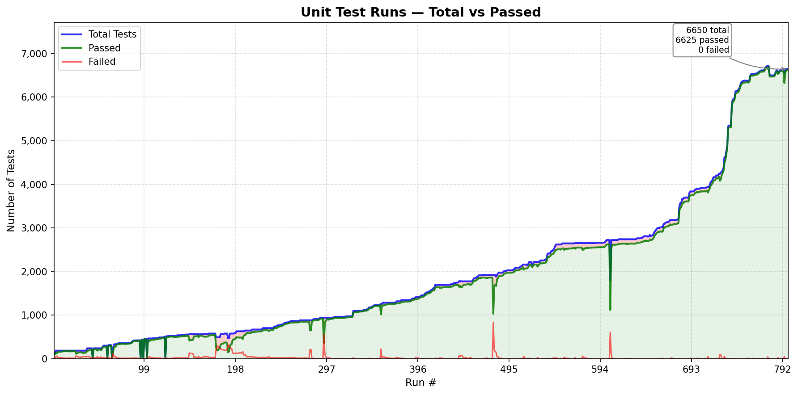
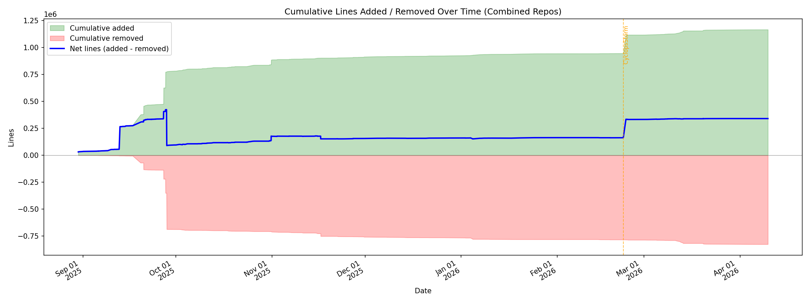
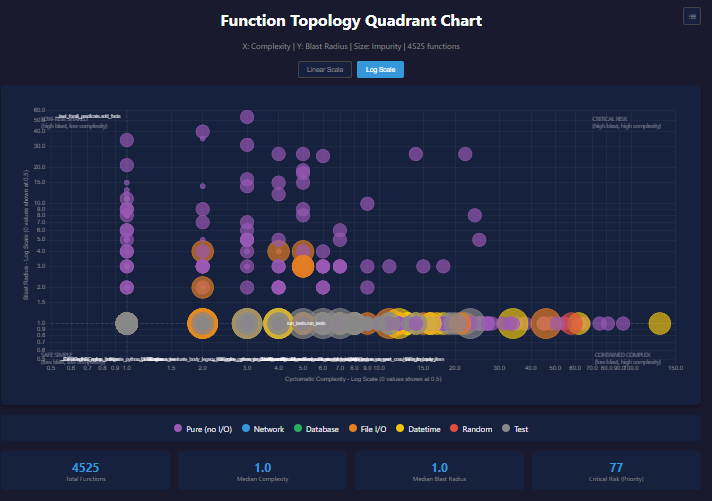

> **Archived September 2026.** This was the project page on May 28, 2026, kept as it was except for these corrections:
>
> - "Feb, 17, 2025" should read 2026; the Substack archive dates the same article February 22, 2026.
> - The "Vacancy.exe, Akiya.exe" link pointed to a different post; it now goes to the right one.
> - Three charts had the same alt text ("unit_test_progress"); each now describes its own image.
> - The code-analysis data and the interactive chart it mentions were removed from the repository; the static charts are in [charts/](charts/).

# "Cyclops Storm" Prolog

[Prolog](https://en.wikipedia.org/wiki/Prolog) (PROgrammation en LOGique, "programming in logic").

- Open lab notes on using AI (mostly Claude Code) to help build a logic engine for science-fiction worlds. This is an ongoing attempt to ["meet minds" with an AI](https://medium.com/ai-advances/an-octopus-two-ais-and-the-problem-of-taste-877d2c427780) over a sprawling logic-programming codebase and an unreasonable amount of coffee.

- [Aaron A. Reed: 50 Years of Text Games](https://if50.textories.com/portal/posters.html)

- Featured big idea: ["Machining the Ghost: Ideating in the Age of AI"](https://natecombs.substack.com/p/machining-the-ghost-ideating-in-the)

- Reference: Knowledge Base Engine public source code repository (coming)

## Status in a Nutshell:
- (4/09/2026) The engine code is in "beta." As I detail [here](https://ai.gopubby.com/my-brief-history-of-ai-coding-e9b0accc1593): I hope to place Cyclops Storm Prolog into a public GitHub repository in 2026. I think it really needs to be accompanied by an application that clearly demonstrates its capabilities. If you have any favorites (something that Claude Code and I might be able to develop), leave your thoughts.

## Docs:
- [Architectural comparison with SWI Prolog: a compare and contrast](https://github.com/Nate-BadScienceFiction/logic-engine-experiment/blob/main/archive/KB_ARCHITECTURE_VS_SWI_PROLOG-2026-04.md). Updated 04/09/2026.
- [KB Engine API and Design Document](https://github.com/Nate-BadScienceFiction/logic-engine-experiment/blob/main/archive/KB_API_AND_DESIGN-2026-04.md). Updated 04/09/2026.

## Unit Tests:
- Updated 05/28/2026
  - 
  
## Change in Code
- Depicted are lines added/removed over time (per commits). Compare them with the unit tests graph. Updated 04/09/2026.
- Note the statistics were aggregated over two repositories -- Cyclops Storm Prolog graduated from a sandbox repository to a dedicated one in late Feb. 2026.
  - 

## Status (Highlights):

- Feb, 17, 2025: ["My Brief History of AI Coding,"](https://medium.com/ai-advances/my-brief-history-of-ai-coding-e9b0accc1593). AI Advances, Medium.
- Nov 14, 2025: ["Marching to Nines with a Robot,"](https://natecombs.substack.com/p/marching-to-nines-with-a-robot). Nate's AI-ish Substack.
- Oct 17, 2025: ["When Heuristics Bite Back,"](https://natecombs.substack.com/p/when-heuristics-bite-back) Nate's AI-ish Substack.
- Sept 28, 2025: ["Fly-By-Wire Debugging,"](https://natecombs.substack.com/p/fly-by-wire-debugging) Nate's AI-ish Substack.
- Sept 18, 2025: ["The Death of Prompt Engineering And Was Carl the Murderer?"](https://natecombs.substack.com/p/the-death-of-prompt-engineering-and) Nate's AI-ish Substack.
- Aug 22, 2025: ["Fly-By-Wire Coding with AI,"](https://natecombs.substack.com/p/fly-by-wire-coding-with-ai) Nate's AI-ish Substack.

## Harriet AI:

- Oct 24, 2025: ["Harriet's Field Guide to Loops,"](https://natecombs.substack.com/p/harriets-field-guide-to-loops?r=9i5dq)
- Sept 26, 2025: [“When Penelope Code Learned to Build,”](https://natecombs.substack.com/p/when-penelope-code-learned-to-build) Nate’s AI-ish Substack.
- Jul 18, 2025: ["Firewalls and Kerosene,"](https://natecombs.substack.com/p/firewalls-and-kerosene) Nate's AI-ish Substack.
- Jul 8, 2025: ["Friends in Low Places,"](https://natecombs.substack.com/p/friends-in-low-places) Nate's AI-ish Substack.
- June 23, 2025: ["Vacancy.exe, Akiya.exe,"](https://natecombs.substack.com/p/vacancyexe-akiyaexe) Nate's AI-ish Substack. 

## (Featured tool:) The Spider 

The Spider is a Claude Code implemented toolset that builds a representation of storyline by stepping from one event to another gleaned from prolog "databases." The "spider's eye" is a tool that reads the same event data and renders an interactive graph that lets you see which events in the story connect, how they cluster, and where the weakly connected gaps are. Here is an [example prolog datafile](https://github.com/Nate-BadScienceFiction/logic-engine-experiment/blob/main/archive/harriets-world-narrative.pl) that is also generated using scripts.
  - .
  - Updated 12/28/2025.

## Codebase Metadata Resources:
- Source code metadata "codepack" (removed September 2026) Updated 03/19/2026.
- The codepack file contains a distillation of the codebase generated by a python utility that Claude Code implemented. Think metadata. The algorithm and schema used is described [in this document](https://github.com/Nate-BadScienceFiction/logic-engine-experiment/blob/main/archive/ANALYZE_CODE_ALGORITHM_DESCRIPTION.md). Updated 12/14/2025.
- The codepack feeds visualizations and analysis. The most recent quad-chart stack was generated from the codepack by another Python script we collaborated on together. Updated 03/19/2026:
  - 
- The quad charts slice these metrics in different ways; see the “algorithm and schema” document for definitions (mentioned earlier). A sample JavaScript quad chart stack was here (removed September 2026). Updated 03/19/2026.

## Other Links

Visit [here](https://nate-badsciencefiction.github.io/logic-engine-experiment/) for better viewing.

